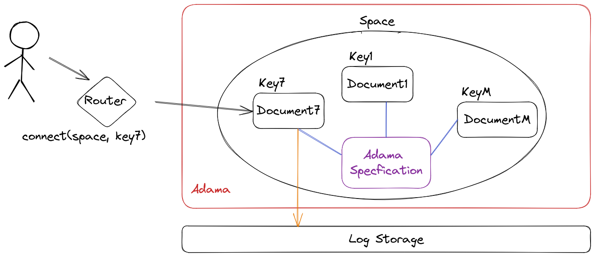

# Concepts of Adama, the platform

This diagram relates the critical components at 10,000 foot altitude.

## Authentication

Users have to present an identity token to talk to Adama. The common case is the identity token is a [JWT token](https://jwt.io/) signed by Adama or your private key. There are special tokens prefixed by "anonymous:" (for example, "anonymous:AgentSmith") to allow random internet visitors into a document.

For more information, see [the authorization guide](reference/auth.md).

## Router and the API space
The router's primary function is to locate documents and proxy connections between the user and the document, and Adama acts as a document store that can handle an infinite number of documents.
Each document is identified by a key and a space.

The main API allows users to connect to documents and then send those documents messages. See [the API reference](reference/api.md) for details about the API.

## Spaces

A space is collection of [documents](#documents) and the configuration, behavior, and mechanics of the space are all determined by an Adama specification via the [Adama language](/guide/start.md).
The [Adama language](/guide/start.md) allows developers to expressively organize data with objects and tables, leverage full ACID transactions to mutate documents, expose computations via reactive formulas with integrated SQL, protect data with privacy logic, coordinate people with workflows, limit client data with viewer dependent queries, leverage temporal distubances, expose web-fetchable resources, and more!

Each space is identified by a globally unique name. Space names must have a length greater than 3 and less than 128, must be alphanumeric or hyphens, and double hyphens (--) are not allowed. 

## Documents

An Adama document is a giant JSON document with a change history.
The [Adama language](/guide/start.md) allows developers to change the document (among other things) and those changes are bundled together into a transaction and written to a log.

Each document is identified by a key that is unique within the owning space. Document keys must have a length greater than 0 and less than 512; validate characters are A-Z, a-z, 0-9, underscore (_), hyphen (-i), or period (.).

## Log storage

Document changes are recorded using [JSON merge](https://datatracker.ietf.org/doc/html/rfc7386) as the patch operation.
Any changes made to the documents are stored as patches in the log storage, which ensures that the system remains consistent and reliable.
The log storage also plays a crucial role in determining the overall performance of the system, making it an essential component of Adama.
